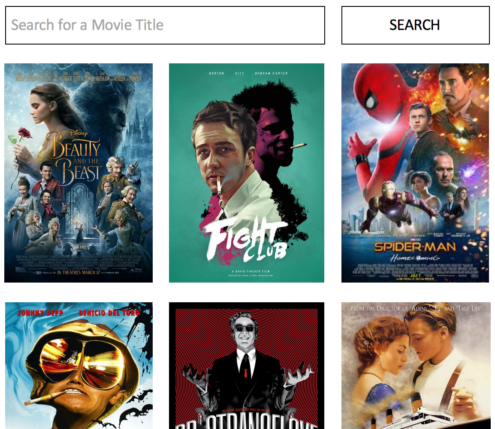
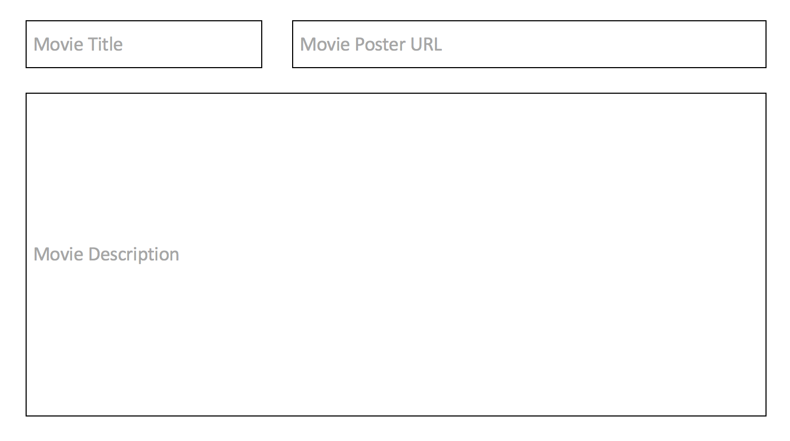
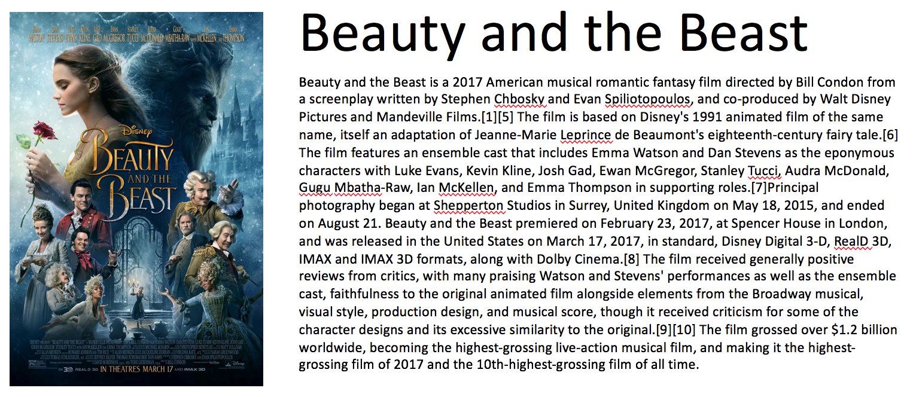

# angular-route-params-mongoose-movie

Use GitHub to work as a team on this project. Split up the tasks and use Pull Requests to merge your code. Spend some time (probably 15+ minutes) planning before diving into the code.

## Base Mode

### Movie Search View

Users should be able to search the database for movies. Clicking on a movie poster image should bring the user to the detailed view for that specific movie. Clicking the `Add New Movie` button should bring the user to the Add Movie view.

### Add Movie View

A view that allows a user to add a new movie to the database.

### Movie Details View

Display the details for a single movie. The url bar in the browser should look something like `localhost:5000/#!/5a295d53e149b1ec7e6800e4`. The last part of this url is the mongo `_id` of the movie in the database.

You will need to research `$routeParams` in order to make this work the right way. This is pretty tough, but look at documentation and ask questions!

## Hard Mode

Add Movie Reviews to the Movie Details page. Reviews should include `rating` (in stars from 1 to 5) and `text` (the content of the review).

User's should be able to add a review and see the reviews of others.

## Pro Mode

Research and use [FileStack](https://www.filestack.com) to to upload images for movies instead of entering a link directly onto the page.